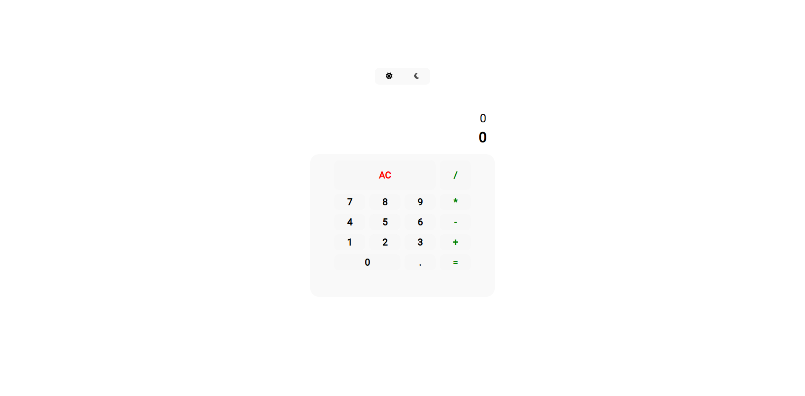
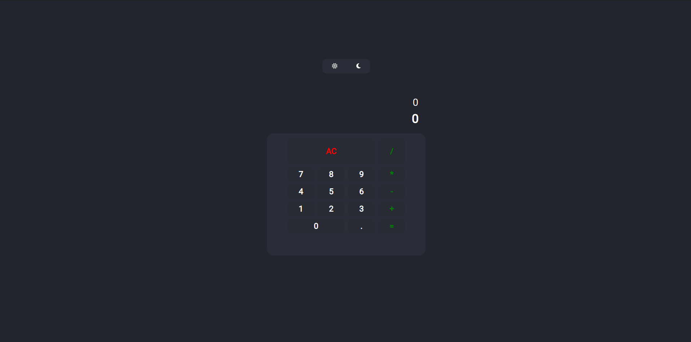

# Calculator with React
<p align="center">Calculator with basic operations, including dark and light theme option.</p>

### Features

- [x] Demonstrate previous value above the result
- [x] Choice of dark and light themes, and save in sessionStorage
- [ ] Operations history

### Demo

<h1 align="center">
  
</h1>

<h1 align="center">
  
</h1>

### 🛠 Technologies

The following tools were used in building the project:

- [Node.js](https://nodejs.org/en/)
- [React](https://pt-br.reactjs.org/)

### Prerequisites

Before starting, you will need to have the following tools installed on your machine::
[Node.js](https://nodejs.org/en/) ou [Docker](https://www.docker.com/).

### 🎲 Running the project

```bash
# Clone this repository or download it
$ git clone <git_repo_url>

# Change the name of the docker containers to the project name and upload the containers
$ make up

# Install the project. Example:
$ make node npm install

# The server will start on port:3000 - go to <http://localhost:3000>